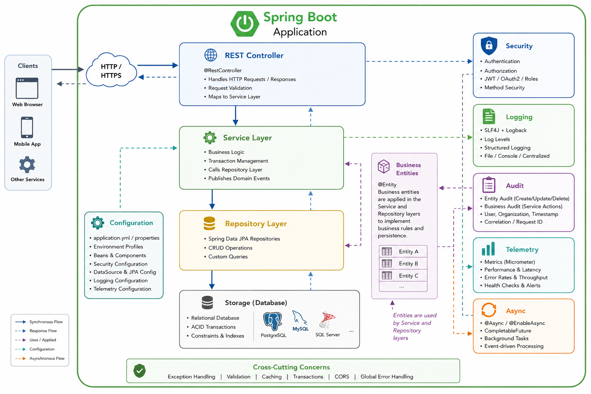

## Generated By
Harbormaster

## Generated For
- Name: Harbormaster Dev Team

## Application
- Name: banking-on-springboot
- Description: Banking Restful Backend
- Company Name: Turnstone National Bank

## Blueprint
- Name: Spring Boot 3.5
- Version: 1.1

## Domain Model
- Name: Banking Industry Domain Model
- Version: 1.0.0

### Entities

Bank
Branch
ATM
Customer
KycProfile
IdentityDocument
RiskAssessment
ScreeningResult
BankingProduct
Account
AccountStatement
Transaction
ExternalAccount
FundsTransfer
StandingInstruction
PaymentCard
LoanAccount
RepaymentSchedule
LoanPayment
Collateral
FeeCharge
ExchangeRate
FXTrade
Dispute
Consent
ThirdPartyProvider

## #Value Objects

Money
Address
AccountNumber
IBAN
BIC
CardPAN
Percentage

### Enums

CustomerType
AccountType
AccountStatus
AccountOwnershipType
StatementDeliveryMethod
TransactionType
TransactionStatus
TransactionDirection
ChannelType
PaymentMethod
PaymentStatus
StandingInstructionFrequency
StandingInstructionStatus
CardType
CardStatus
CardNetwork
LoanType
LoanStatus
RateType
InterestCompounding
InstallmentStatus
FeeType
RiskRating
KycStatus
IdentityDocumentType
ScreeningOutcome
TradeStatus
ATMStatus
ConsentType
ConsentStatus
DisputeStatus
ProductCategory
CollateralType

## CI Platform
- Name: 

## GitHub
- Host: https://github.com
- Owner: Harbormaster-AI
- Repo: banking-on-springboot

## Docker
- Host: docker.io
- Org Name: theharbormaster
- Repository: banking-on-springboot
- Tag: latest

## AWS
- accessKey: xxxxxxxxxxxxxxxx
- secretKey: xxxxxxxxxxxxxxxx
- region: us-east-2
- ec2InstanceType: 
- dbInstanceType: 
- vpc: xxxxxxxxxxxxxxx
- AMI Image Id: 

## Spring Boot v3.5x Details
### Overview

> Spring Boot is a mature, enterprise-ready application framework built on Spring Framework 5 that simplifies the development of ]
production-grade Java applications through convention over configuration, auto-configuration, and embedded application servers.
It provides comprehensive support for REST APIs, Spring Data JPA, Spring Security, dependency injection, validation, scheduling,
asynchronous processing, and production monitoring, making it an excellent platform for building scalable microservices and traditional enterprise applications. 

### Architecture

> Spring Boot promotes a layered, component-based architecture that cleanly separates presentation, business logic, data access, and infrastructure concerns,
enabling scalable and maintainable enterprise applications.  ell suited for developing RESTful APIs, microservices, and cloud-native applications using
dependency injection and convention-over-configuration.

### Security

> Spring Boot integrates with Spring Security 5 to provide a comprehensive security framework for securing web applications, REST APIs, and microservices. I
t supports multiple authentication mechanisms including Form Login, HTTP Basic Authentication, OAuth2 Login, OAuth2 Resource Server (JWT), and custom
authentication providers while offering robust authorization through role- and authority-based access control.

To apply security, see options below (form-l ogin, jwt, oauth2, none)

### Logging

> Spring Boot provides a flexible and production-ready logging framework built on SLF4J with Logback as the default logging implementation.
It offers configurable logging levels, structured log formatting, rolling log files, and seamless integration with application components,
enabling developers to capture diagnostic, operational, security, and business events consistently across the application.

To apply logging, see options below (logstash, gelf, ecs) 

### Auditing

> Harbormaster provides a comprehensive auditing framework that captures both entity-level changes and business-level operations to deliver
complete application traceability. Entity auditing automatically records lifecycle events such as record creation, modification, and deletion,
while business auditing captures significant business activities performed through the service layer, including the operation performed, user identity,
organization, outcome, execution time, and contextual metadata. 

### Storage

> Spring Boot provides a robust persistence layer through Spring Data JPA and Hibernate, simplifying the development of database-driven applications
while promoting a clean separation between business logic and data access. It supports object-relational mapping (ORM), repository-based data access,
declarative transaction management, and integration with a wide range of relational database management systems.

Harbormaster generates all the annotation and property settings to handle persistence for all entities discovered in a domain model.

### Telemetry

>Harbormaster provides an extensible telemetry framework that collects runtime metrics and operational data to monitor the health, performance,
and behavior of enterprise applications. Through configurable instrumentation, telemetry captures service execution metrics, request throughput,
response times, error rates, resource utilization, and other operational indicators, enabling proactive monitoring, capacity planning, and performance optimization.

This architecture provides operational visibility into application behavior, allowing development and operations teams to detect performance issues, monitor service health, and continuously optimize system performance.

### Validation

> For each modeled entity, Harbormaster generates a complete set of validation classes and methods to validate data befoe being persisted to an entity store.

## Options

> The following options are available to be applied from the Web UI and a System-as-Code Yanl file.

- server-port:              	port to listen on. default: 8080
- entity-store-type:        	database engine to use to store entities. options: h2, mongodb, mysql, postgres
- entity-store-url:           	Url to connect to the database
- database-username:          	database username
- database-password:			database password
- spring-profiles-active:		list of profiles to activate. options: sync, async
- authentication-mode:        	mode of authentication to apply: options: form-l ogin, jwt, oauth2, none
- logging-type:               	logging type. options: logstash, gelf, ecs
- enable-entity-auditing:     	generate audit related attributes for each entity, options: true/false
- enable-service-level-monitoring: apply telemetry at the Service level. options: true/false

## Build

Tool - Maven v 2.8.1
JDK - 17

**Key Build Dependencies**

org.springdoc/springdoc-openapi-starter-webmvc-ui:2.8.17:compile  
org.springframework/spring-messaging  
org.springframework.boot/spring-boot-starter-web  
org.springframework.boot/spring-boot-starter-data-jpa  
org.springframework.boot/spring-boot-starter-actuator  
org.springframework.boot/spring-boot-starter-security  
org.springframework.boot/spring-boot-starter-oauth2-resource-server  
org.springframework.boot:/spring-boot-starter-oauth2-client  
org.springframework.boot/spring-boot-starter-test:test  
org.springframework.boot/spring-boot-configuration-processor:true  
org.springframework.boot/spring-boot-starter  
org.jetbrains.kotlin/kotlin-stdlib  
org.jetbrains.kotlin/kotlin-reflect  
io.projectreactor/reactor-core  
org.projectlombok/lombok:true  
org.slf4j/slf4j-ext  
com.fasterxml.jackson.module/jackson-module-kotlin  
com.thoughtworks.xstream/xstream:${thoughtworks.xstream.version}  
org.projectlombok/lombok  

**Optional**

org.springframework.boot/spring-boot-starter-data-mongodb  
com.mysql/mysql-connector-j  
org.postgresql/postgresql  
com.h2database/h2:runtime  
